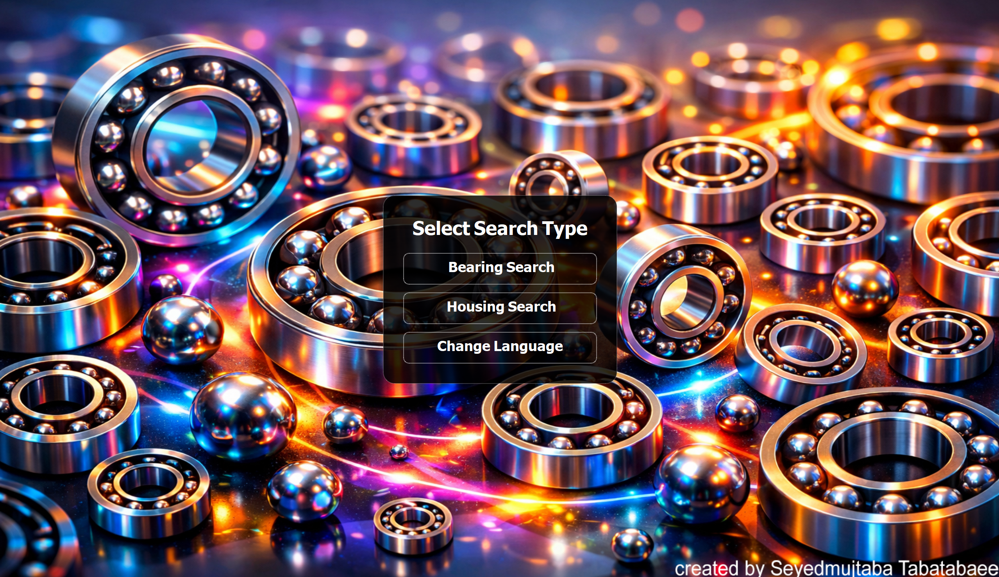

# 🧩 Ball Bearing

## 📌 Project Overview
**Ball Bearing** is an **industrial desktop application** designed to identify and describe **ball bearings and bearing housings** based on their physical dimensions.

By entering the bearing or housing dimensions, users can:
- Identify the **exact bearing or housing model**
- View a concise summary of **technical features**
- Understand the **typical industrial applications** of the selected component

This application is intended for **mechanical engineers**, **engineering students**, and **maintenance & repair professionals**.

---

## ⚙️ Features
- Identification of ball bearings and housings based on dimensions  
- Clear and concise technical information  
- Industry-oriented design and output  
- Offline usage (catalog-based)  
- Simple and user-friendly interface  
- Multi-language support  

---

## 🌐 Language Support
The application supports the following languages:
- 🇬🇧 English  
- 🇮🇷 Persian (Farsi)

### Language Selection

---

## ⬇️ Download

You can download the latest compiled **Windows executable (.exe)** from the GitHub Releases page:

👉 **[Download Latest Release (EXE)](https://github.com/Seyedmujtaba/Ball-Bearing/releases)**

**How to download:**
1. Open the link above  
2. Select the latest release  
3. Scroll to the **Assets** section  
4. Download the `.exe` file  
5. Run the application directly (no installation required)

> ⚠️ **Note:**  
> Windows SmartScreen may display a warning because the application is not digitally signed.  
> Click **More info → Run anyway** to proceed safely.

---

## 🧰 Prerequisites
No development environment or additional dependencies are required.

- **Operating System:** Windows  
- **Requirement:** Downloaded `.exe` file from GitHub Releases  

Python or any external libraries are **not required**.

---

## ▶️ How to Use

1. **Run the Application**
   - Double-click the downloaded `.exe` file.
   - The language selection menu will appear at startup.

2. **Select Language**
   - Choose **English** or **Persian (Farsi)**.

3. **Enter Dimensions**
   - Input the required dimensions:
     - Inner Diameter (ID)
     - Outer Diameter (OD)
     - Width

4. **View Results**
   - The application displays:
     - Bearing or housing **model number**
     - Key **technical specifications**
     - Typical **industrial applications**

5. **Apply the Information**
   - Use the results for design, maintenance, or educational purposes.

---

## 📸 User Interface Preview

### Menu (English | Persian)

  
  

---

### Ball Bearing (English | Persian)

  
  

---

### Housing (English | Persian)

  
  

---

## 📚 Data Source
All technical data and specifications used in this project are based on the following trusted industrial reference:

- **SKF Global Catalog**  
  ([PDF Source](sources/full-source.pdf))

---

## 🏭 Applications
- Industrial bearing and housing selection  
- Mechanical design support  
- Maintenance and repair operations  
- Engineering education and training  
- Quick technical reference for bearing specifications  

---

## 🚀 Future Improvements
- Support for additional bearing types and standards  
- Load capacity and speed calculations  
- Advanced filtering and search options  
- UI/UX improvements  
- Integration of additional manufacturers’ catalogs  

---

## 📄 License
This project is provided for **educational and industrial reference purposes**.  
Please review the license file for usage and distribution terms.

---
